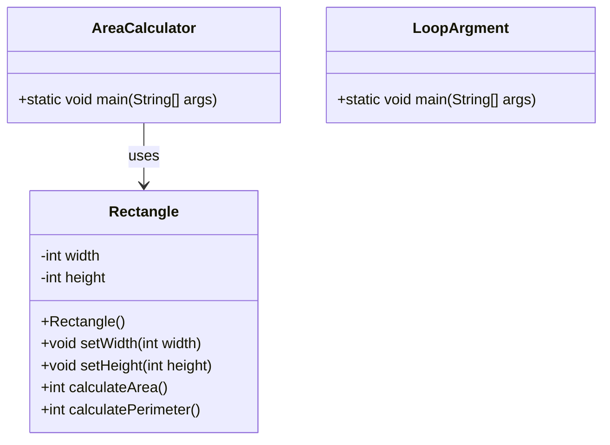

# Class Diagram (Java)

Below is a simple class diagram representing the key classes in this workspace using Mermaid syntax.

> 💡 **Tip:** Render Mermaid diagrams in supported Markdown viewers (e.g., VS Code with Mermaid extension).
